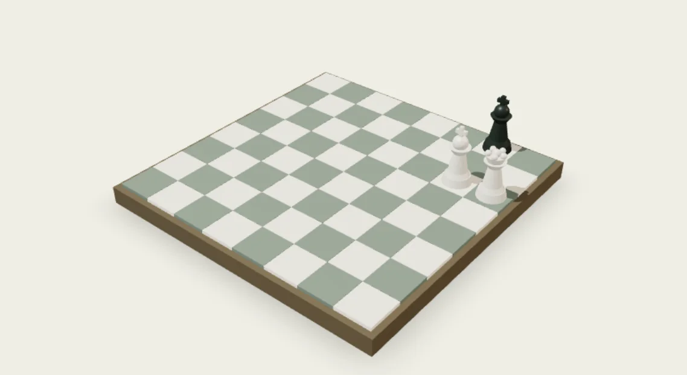

# Salah-Eddine Lachkar · Portfolio

An editorial portfolio with playable 3D chess puzzles, built with **Next.js,
TypeScript, and Three.js**.

**[Explore the live website](https://lachkar.me)**

This public repository preserves the chess edition. The current live website uses an interactive robotic arm; the career content and downloadable CV are kept aligned with it.

The downloadable CV is the public version: portrait, email and professional links, with no personal phone number. The recruiter version and editable source documents are maintained privately.



## Highlights

- Responsive career and project sections, with a downloadable CV.
- Mate-in-1, mate-in-2, and mate-in-3 studies generated by exhaustive search.
- Interactive Three.js board, keyboard navigation, and a playable 2D fallback.
- Installable PWA with offline portfolio, CV, and chess access after caching.
- Unit tests plus desktop/mobile Playwright checks and accessibility checks.
- Standalone Docker runtime running as an unprivileged user.

## Get started

Use Node.js 24.

```sh
npm ci
npm run dev
```

Open http://localhost:3000. For a production build:

```sh
npm run build
npm start
```

## Checks

```sh
npm run check
npm run build
npx playwright install chromium
npm run test:e2e
npm audit
```

Browser tests start the production server on port 3104. To use an existing
server, set `BASE_URL` explicitly. The test suite covers desktop and mobile
Chromium; installation behavior on Safari/iOS should be verified on a device.

## Project map

| Path | Purpose |
| --- | --- |
| `src/data/portfolio.ts` | Public career and project content |
| `src/data/seo.ts` | Canonical URL and structured identity |
| `src/components/chess-puzzle.tsx` | Accessible chess interaction |
| `src/components/chess-scene.tsx` | Lazy-loaded 3D board |
| `src/lib/` | Chess rules and puzzle selection |
| `scripts/generate-puzzles.mjs` | Offline puzzle generation |
| `scripts/service-worker.js` | Offline caching lifecycle |
| `tests/` | Unit, browser, and accessibility checks |

## Make it your own

Replace the career data, canonical URL, email, CV, brand artwork, and metadata
with your own before publishing a derivative. Update related tests to match your
content. Keep credentials and private documents out of the repository.

## Docker

```sh
docker compose up --build -d --wait
```

The container is available at http://127.0.0.1:3004. Stop it with
`docker compose down`. The public source distribution contains quality checks;
your hosting and deployment credentials belong in your own private configuration.

## Offline behavior

`npm run build` generates a release-specific service worker. After a successful
online load and background cache download, the portfolio, CV, and chess can work
offline. Storage eviction can remove this capability. External links still need
connectivity. Replacement workers activate after existing windows close.

## License and credits

Source code and technical documentation are under [MIT](LICENSE). See
[NOTICE.md](NOTICE.md) for personal content, branding, and dependency attribution.
Contributions: [CONTRIBUTING.md](CONTRIBUTING.md). Private vulnerability reports:
[SECURITY.md](SECURITY.md).
